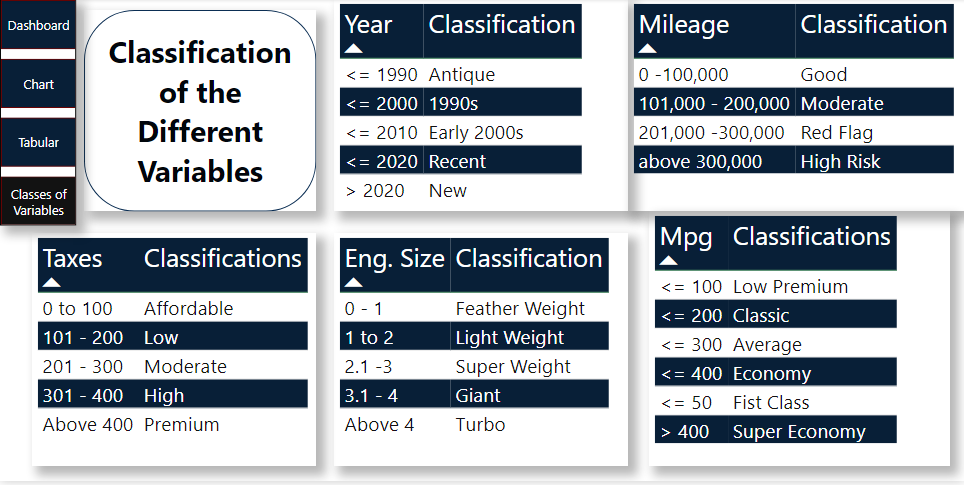
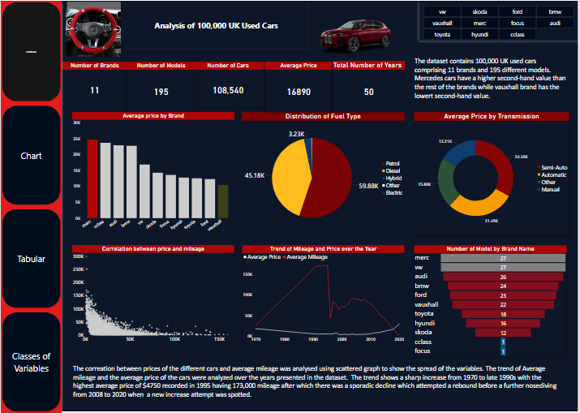
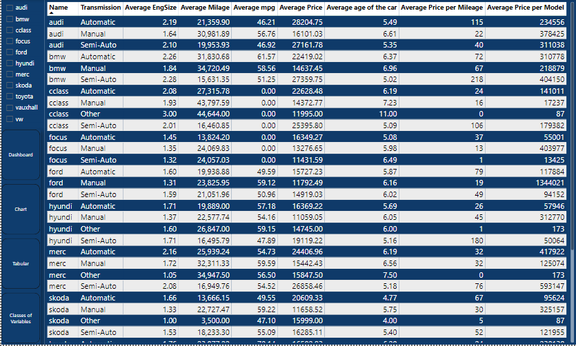

# Project Name: 10,000 UK Used Cars Report

...
## Project Objective

The objective of this project is to analyze the scraped data of UK used car listings of up to 100,000 comprising different manufacturers and models and visualize the result with Microsoft Power BI.

## Problem Statement

* What is the average price of each car manufacturer in the dataset?
* What is the correlation between the price and mileage of the cars?
* What is the distribution of fuel types across the dataset?
* How does the road tax impact the price of the car?
* What is the trend of the mileage and price of the cars over the years?
* And more insights as could be found.

....
## Data Sourcing

The data for this project was sourced from an online database. This can be accessed [Here](https://www.kaggle.com/datasets/adityadesai13/used-car-dataset-ford-and-mercedes)

## Data Transformation

 - Data Gathering: The dataset file comprising thirteen different files was imported into Microsoft Power BI using a Folder connector to import all the files at once.

 Data Cleaning: To make the data usable for the required analysis, the following tasks were performed:
1. I performed the cleaning of the data by removing errors and null values. 
2. Dirty duplicates of certain data were removed from the dataset.
3. I replaced the year 2060 with 2006. 
4. Different variables were distributed into classes for ease of analysis.
5. Additional columns with New Measures were created to calculate average prices and the ages of the cars, using DAX expressions.
6. Modelling was carried out between the data to ensure accurate connectivity.

### Classifications of Various Variables

### Data Analysis and Insights

From the analysis carried out, the following was discovered:
1. There were a total of 11 car brands with 195 models.
2. Mercedes car brand has the highest price while Vauxhall has the lowest second-hand value.
3. After removing dirty data and errors, we have left a total of 108,540 cars.
4. The average price of the cars is £16,890
5. The cars' years span over fifty (50 years).
6. The most efficient fuel type is electric while the least efficient are the cars using petrol type of fuel.
7. The brands with the highest number of car models are Mercedez and Volkswagen with 27 models each while the brands with the least number of models are CClass and Focus with only 1 model each.
8. Auto-transmission vehicles have the highest average price while the manual transmission types have the lowest average price
9. The trend of mileage and price over the years shows that there was a sharp increase between 1970 to mid-1990 with the highest average price around 1995 which was followed by a sharp decline in price trend.

10. Cars in the Antique class show a higher average price range than the newer range possibly because of their uniqueness in rarity and features. Most buyer likely want to buy back their youths; as a form of collection.
11. Vehicles in the 1990s have the lowest average price, this might be due to the fact that they were made during a period when carbon emission was high.
12. As to be expected, taxes have an impact on the average price of cars as the highest average price falls within cars with the premium road tax, and cars in the class of featherweight have the lowest average price.  
13. Cars with low mileage have high average prices while cars with high mileage classified as high risk have the lowest price.
14. The comparison of tax impact between the affordable tax class ( £0 - £100) and the high tax class ( £301 - £400) shows that Skoda car brand under the high tax class is more favored than the affordable tax class with a huge 308% tax relief. Next to Skoda is the Vauxhall car brand, with a 117.25% change. This was shown in the ribbon chart. In the absolute term, however, the tax rate is progressive as premium brands are taxed more.
15. Most of the variables have an impact on the sale and price of the cars. 

    

More insights can be seen on the tabular chart below of the impacts of various elements on the sale and prices of the cars.

You can interact with the report [here](https://app.powerbi.com/groups/8da3a3c6-0dc0-4c56-ba8d-510a929cca8d/reports/79c1dfeb-78d3-4bd6-9469-1b7aa5d6554e?ctid=0f4b7089-c4c8-43da-8959-f3ea16f5eabb&pbi_source=linkShare&bookmarkGuid=05debe1c-c338-419e-8f1b-8711206b9c3b)

......
# Conclusion and Recommendations

1. Audi brand of car has the highest average price with the following statistics:
- Average Price       £62,246.67
- Year                9 Years
- Average mpg         23.33
- Avg. EngSize        4.53
- Avg. Mileage        13,590.67
- Transmission        Semi-Automatic
- Tax                 £570
- Avg price/Mileage   £5

2. BMW car brand has the lowest average price with the following statistics:
-  Average Price      £1200
- Year                24 Years
- Average mpg         31
- Avg. EngSize        2.8
- Avg. Mileage        82,000
- Transmission        Semi-Automatic
- Tax                 £245
- Avg price/Mileage   £0

3. Prices of cars in their recent years are generally higher than the older cars.
4. Prices are shown to be more impacted by the Mileage and Age of the cars.

