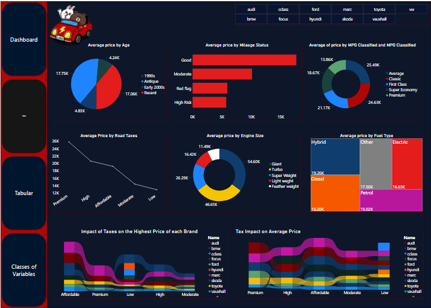

# Project Name: 10,000 UK Used Cars Report

...
## Project Objective

The objective of this project is to analyze the scraped data of UK used car listings of up to 100,000 comprising different manufacturers and models and visualize the result with Microsoft Power BI.

## Problem Statement

* What is the average price of each car manufacturer in the dataset?
* What is the correlation between the price and mileage of the cars?
* What is the distribution of fuel types across the dataset?
* How does the road tax impact the price of the car?
* What is the trend of the mileage and price of the cars over the years?
* And more insights as could be found.

....
## Data Sourcing

The data for this project was sourced from an online database. This can be accessed [Here](https://www.kaggle.com/datasets/adityadesai13/used-car-dataset-ford-and-mercedes)

## Data Transformation

 - Data Gathering: The dataset file comprising thirteen different files was imported into Microsoft Power BI using a Folder connector to import all the files at once.

 Data Cleaning: To make the data usable for the required analysis, the following tasks were performed:
1. I performed the cleaning of the data by removing errors and null values. 
2. Dirty duplicates of certain data were removed from the dataset.
3. I replaced the year 2060 with 2006. 
4. Different variables were distributed into classes for ease of analysis.
5. Additional columns with New Measures were created to calculate average prices and the ages of the cars, using DAX expressions.
6. Modelling was carried out between the data to ensure accurate connectivity.

### Classifications of Various Variables

###Data Analysis and Findings

From the analysis carried out, the following was discovered:
1. There were a total of 11 car brands with 195 models.
2. Mercedes car brand has the highest price while Vauxhall has the lowest second-hand value.
3. After removing dirty data and errors, we have left a total of 108,540 cars.
4. The average price of the cars is $16,890
5. The cars' years span over fifty (50 years).
6. The most efficient fuel type is electric while the least efficient are the cars using petrol type of fuel.
7. The brands with the highest number of car models are Mercedez and Volkswagen with 27 models each while the brands with the least number of models are CClass and Focus with only 1 model each.
8. Auto-transmission vehicles have the highest average price while the manual transmission types have the lowest average price
9. The trend of mileage and price over the years shows that there was a sharp increase between 1970 to mid-1990 with the highest average price around 1995 which was followed by a sharp decline in price trend.

## Visualization

You can interact with the report [here](https://app.powerbi.com/groups/8da3a3c6-0dc0-4c56-ba8d-510a929cca8d/reports/79c1dfeb-78d3-4bd6-9469-1b7aa5d6554e?ctid=0f4b7089-c4c8-43da-8959-f3ea16f5eabb&pbi_source=linkShare&bookmarkGuid=05debe1c-c338-419e-8f1b-8711206b9c3b)

......
# Findings and Recommendations
