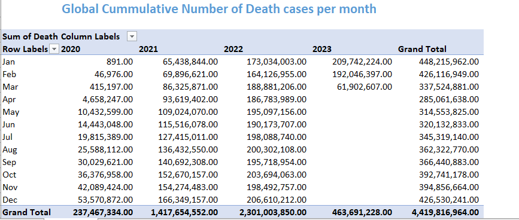

# Project Name: Covid-19 Data Analysis Report

...
## Project Objective

The year 2020 went down in history as the year the whole world was shut down due to the global epidemic of Coronavirus disease (COVID-19), an infectious disease caused by the SAR-CoV-2 Virus. This report is meant to analyze the impact, globally; highlighting the most affected and the less affected countries using the major parameters of Confirmed cases, Recovered cases, and Death cases by leveraging Microsoft Excel.

## Problem Statement

1. What is the total number and the percentage of confirmed cases?
2. What is the total number and the percentage of recovered cases?
3. What is the total number of death cases?
4. What is the percentage of deaths to confirmed cases?
5. What is the percentage of deaths to recovered cases?
6. What is the trend of yearly and monthly confirmed cases?
7. Which are the most affected and the least affected five countries in the world?

....
## Data Sourcing

The dataset was sourced from a public repository on GitHub.

## Data Transformation

- Data Gathering and Understanding: The dataset for this project was part of a dataset shared on Github by Olanrewaju Oyinbooke in the 30 Days of Learning challenge. Link here. The datasets were in three different CSV files which I first worked on to understand the model.
 
- Data Cleaning and Transformation: The raw data of the CSV files were downloaded from the Github repository one after the other into Excel Power Query using a Web connection.

The dataset was wide data so after getting the first dataset, I unpivoted Columns to reduce it to two columns, Date and Value, where all dates were pivoted to Date column and Value in one column after which I renamed the columns. 
The data was then duplicated to bring in the second data set for death cases. The data source was changed to reflect the data for death cases. 

All the the previous steps were also applied to this dataset after which I connected the third dataset for recovered cases,
After all steps were applied, I merged the tables to have a consolidated data set comprising the three data datasets. 
Redundant columns were removed, errors were removed, null values were removed, and other necessary cleaning was carried out.

- Data Analysis: The consolidated dataset was used to carry out different analyses like the number of total confirmed cases, recovered cases, and death cases. The percentages of death for each parameter were also carried out. We also calculated the cumulative total confirmed cases per month, quarter, and year from 2020 to 2023. 

- Data Visualization: The results of the analysis carried out above were used to create visualizations and dashboards to describe the insights.

- Summary and Observations: Finally, these insights are used to highlight my observations

               

## Visualization

The report comprises 6 pages
1. The Consolidated Data
2. Confirmed Cases
3. Recovered Cases
4. Death Cases
5. The Analysis
6. The Insights

......

You can interact with the report [here](https://app.powerbi.com/groups/8da3a3c6-0dc0-4c56-ba8d-510a929cca8d/reports/79c1dfeb-78d3-4bd6-9469-1b7aa5d6554e?ctid=0f4b7089-c4c8-43da-8959-f3ea16f5eabb&pbi_source=linkShare&bookmarkGuid=05debe1c-c338-419e-8f1b-8711206b9c3b)

# Findings and Insights

## Findings

1. The total number of reported confirmed cases was  316,910,296,319
2. The Total number of recovered cases was 23,227,207,571 which is 7.33 % of confirmed cases.
3. The total of death cases was    4,419,816,964 which was 1.33% of the confirmed cases and 19.03%  of recovered cases
4. The top five (5) countries with recorded cases of the pandemic were
          USA, India, Brazil, France and Germany
5. North Korea had the least cases of COVID-19 with a reported number of 300 cases  

**_Note_**: The monthly, quarterly, and yearly totals shown in the analysis are cumulative totals
The analysis is based on the available information which are the reported cases.
The year 2023 has few data and insights because record-taking has relaxed since sometime in August 2022 when the occurrence of the epidemic has waned.
