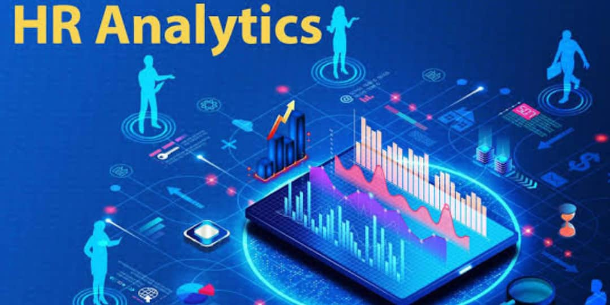
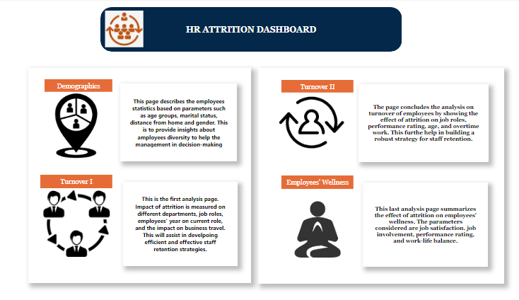
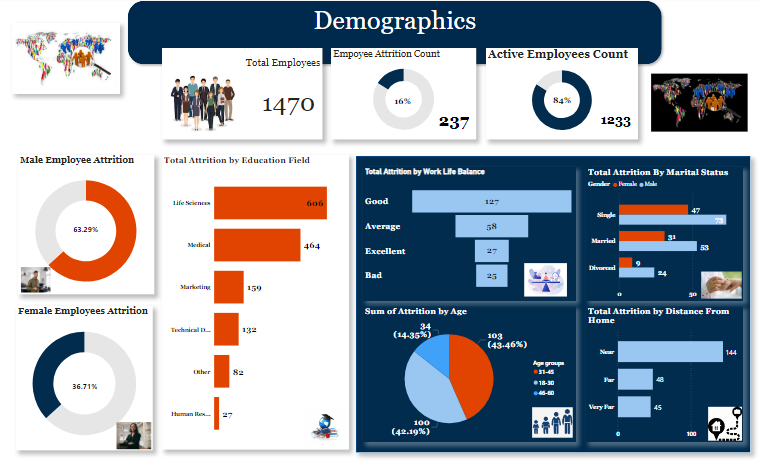
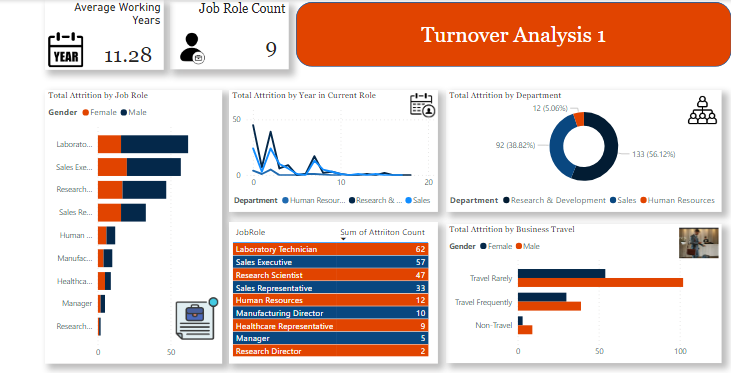
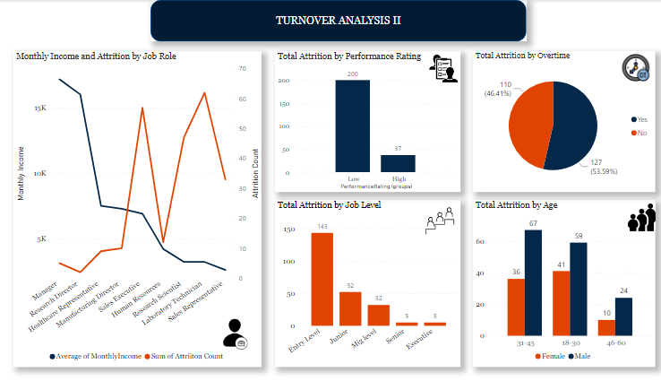
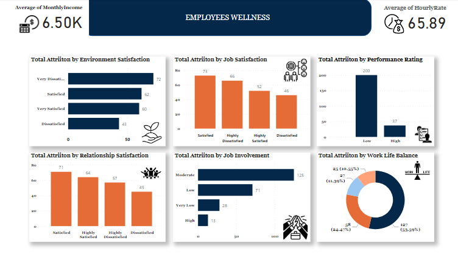

# Project Name: HR Analytics - Employee Attrition Report

...
## Project Objective

To carry out an analysis of human resources data and bring out insights that will help decision-making in optimizing talent management and organizational performance.

....
## Data Sourcing

The dataset was provided by MeriSkill US as an internship project dataset.

## Data Transformation

Necessary data cleaning was carried out to remove redundant columns, drop duplicates, and rename columns using Power Query in Power BI

I grouped data in columns representing employees' job satisfaction, work-life balance, relationship satisfaction, and performance rating. This is to enable a  neat classification of such parameters.

With the clean data set, it was easy to carry out analysis and bring out useful insights. New measures were also used in Power BI for further analysis without burdening the report with more columns.

- Data Visualization: By using the results of the analysis, an interactive dashboard and visualizations were created to describe the insights.

The first page of the visuals is dedicated to the overview of the entire dashboard.

  

Page two of the visual shows the employees' demographics. On this page is the summary of the impact of attrition based on gender, marital status, distance from home, and age group.

  

1. The total number of employees is 1470
2. The total number of active employees is 1233 while the attrition count is 237.
3. A percentage of 63.29% of male employees are affected by attrition with single males having the highest number, while female employees have an impact of 36.71%.
4. The attrition has a greater impact on employees who live near to the office than those living far and very far from the office.
5. There was a higher attrition rate among the employees in the age bracket of 18 years and 45 years.

## Pages 3 and 4

  

  

Pages 3 and 4 display the effect of attrition on different departments of the organization, job roles, years in current position, business travel, job level, performance rating, and working overtime. The findings are:

1. The Research and Development department suffers more attrition rate with 133 out of the 247  employees affected by attrition, followed by the Sales department.
2. There was a higher attrition among employees working overtime.
3. Employees with a low-performance rating have a higher rate of attrition
4. Entry-level employees have a higher attrition rate.

## Page 5

  

The last page displays the relationship between attrition and employees' wellness by considering the job satisfaction, relationship satisfaction, environmental satisfaction, job involvement, and work-life balance of employees.

1.  Employees who are very dissatisfied with the environment are impacted more by attrition.
2. Attrition occurs more in employees categorized as having a good and average work-life balance, respectively.
3. More attrition was experienced among employees with satisfied relationships.
4. There is a higher number of attrition of 125 among employees with moderate job involvement.

You can interact with the report [here](https://app.powerbi.com/links/6Z4M0l-ywi?ctid=5a761db5-64d6-43bf-84e4-cc6cbb8a23e3&pbi_source=linkShare)
......

## Recommendations:

1. The research and development department needs to be monitored to understand the reason behind the highest attrition rate experienced there. Consideration should be taken to whether the high attrition has any relationship with low performance. Are the right people employed? and so on.
2. The onboarding process of new employees needs to be overhauled to confirm that it serves the purpose of adequate training for the new entrants. 
3. Training should be considered for entry-level employees if the high attrition level is due to under-performance.
4. Staff welfare and health must be considered to ensure that the working environment is satisfactory.
5. Employees should be carried along and allowed to be more involved in business activities. This will increase their buy-in and trust.
6. The working conditions of overtime employees should be considered.
