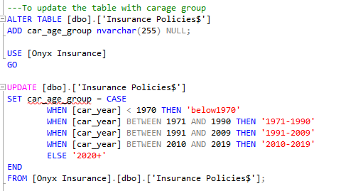
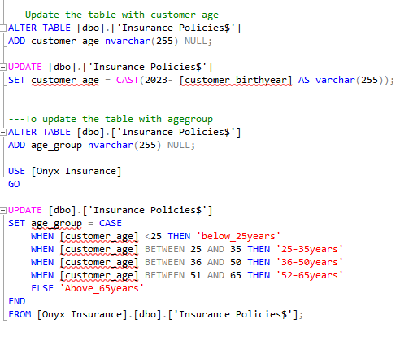
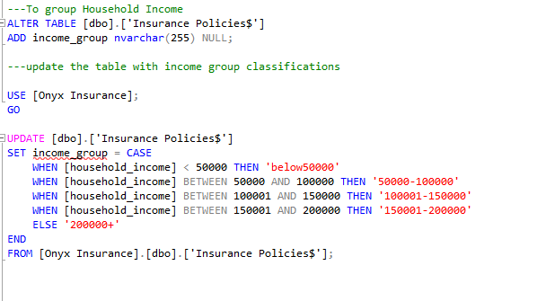
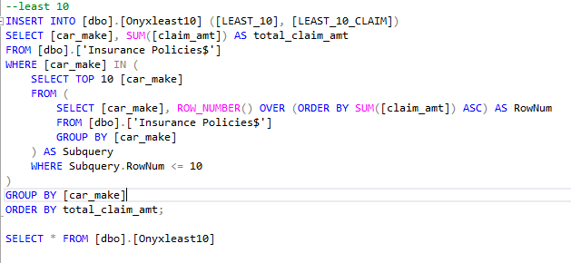
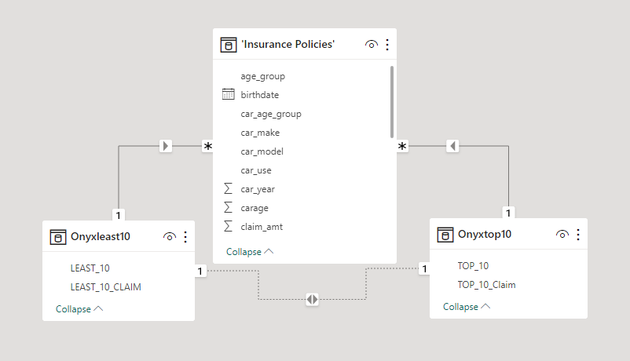
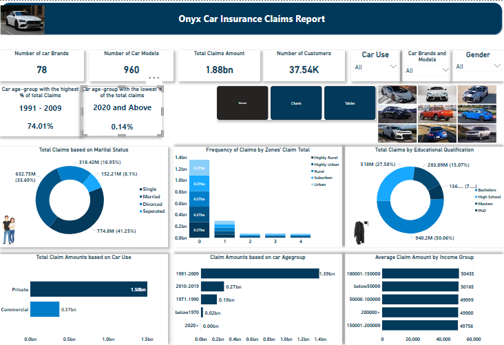
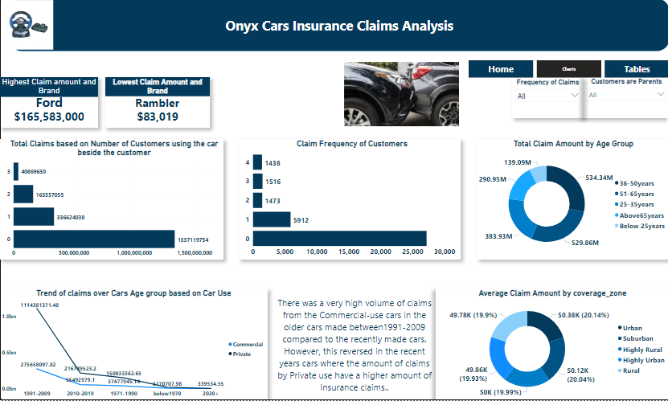
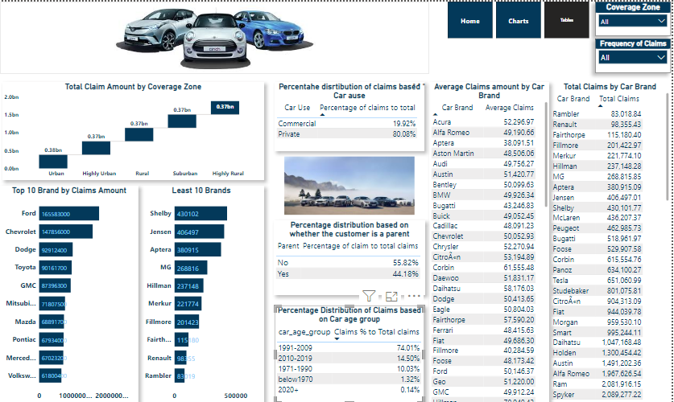

# Project Name: Onyx Car Insurance Claims Report

...
## Project Objective

To analyze the impact of different elements amount of claims by customers of Onyx Insurance and Onyx Insurance company.

## Problem Statements

1. What is the total number of car brands and models of cars insured?
2. What is the number of customers?
3. What is the effect of gender on Claims?
4. Do the uses of cars and the geographical zones have an effect on the Car Insurance policies?
5. What are the age groups of customers and the effect of age on the sum of claims?
6. What is the effect of the age of cars on the amount of the claims?
7. What is the brand with the highest claim amount?
8. Which brand has the lowest claim amount?
9. What are the top 10 brands with the highest insurance claims? 
10. Which are the least 10 brands based on the amount of claims?

....
## Data Sourcing

The dataset was sourced from Onyx Data as part of their monthly data challenge.

## Data Transformation

- Data Cleaning
  I took time to understand the data set so as to know the best tool to use. I chose SQL for my data cleaning to make splitting and joining easier and I used Microsoft Power BI for data visualization.
  
### The following are also performed to clean the data before embarking on analysis:

After importing the dataset into the SQL server, I ensure the data types are in accurate form for each of the columns.

I used the CASE Statement to classify the car manufacturing years, Customers' birth year, and the Customers' income levels into groups for ease of analysis.

Claim amounts are ranked to highlight the top 10 brands and the least 10 brands based on the sum of claim amounts received.

The data was later split into three tables with an additional two tables to represent the top 10 and the least 10 brands based on insurance claims amount. This is to allow further data transformation.

The new tables have two columns each and null values were removed from the tables 

All the above were performed inside the SQL server.

After this, the clean data was exported into Power BI for modeling and visualization

## Data Modelling and Analysis

The modeling of data was performed in Power BI.

With the clean data set, it was easy to carry out analysis and bring out useful insights using Microsoft Power BI.

- Data Visualization: By using the results of the analysis, an interactive dashboard and visualizations were created to describe the insights.

  

## Visualization

You can interact with the report [here](https://app.powerbi.com/groups/me/reports/88b47cca-c006-4a7a-9aaa-06baee7d1213/ReportSectionbc1f77fd7e73eb300827?experience=power-bi)

# Findings and Recommendations

## Findings

1. The total number of customers is 35,741.
2. Total number of car brands is 78 having 960 different car models.
3. The total amount of Insurance claimed is $1,878,170,476.20.
4. The Car age group with the highest sum of claims are cars manufactured between the years 1991 and 2009 which has $1,390,039,469.30 representing 74.01%; while the age group with the lowest sum of claims is care made from the year 2020 and above with $2,619,874.02 which represents 0.14% of the total claims.
5. The income of customers does not have a significant effect on the amount of claims
6. the bulk of the claims come from customers between the ages of 36 years and 65 years. 
7. More than 50% of the total claims were from customers with bachelor's degrees while Ph.D. holders account for the lowest percentage of 7.29%.
8. The urban zone recorded the highest claim amount of $50,377.73 while the rural zone showed the lowest claim of $49,778.02 based on the coverage zones. 
9. Singles and married customers account for the highest claims based on marital status.
10. 55.82% of claims came from customers who are parents while 44.18% of the total claims came from customers who are not parents.
11. Most of the customers are using the caras alone. The sum of the claims of cars used by the customers alone is higher than the total claims of those with more users.
12. The Top 10 brands and the Least 10 brands are as follows:

Top 10 Brands Based on Claimsare:

1. Ford
2. Chevrolet
3. Dodge
4. Toyota
5. GMC
6. Mitsubishi
7. Mazda
8. Pontiac
9. Mercedez-Benz
10. Volkswagen

Least 10 Brands Base on Claims:

1. Shelby
2. Jensen
3. Aptera
4. MG
5. Hillman
6. Merkur
7. Fillmore
8. Fairthorpe
9. Renault
10. Rambler

## Recommendations:

1. More awareness should be created among commercial car users to maintain the close of the gap between them and private users as has been experienced recently and more efforts should be made to increase the volume of customers.
2. Efforts should be made more on married and singles as the analysis shows that most of the customers fall into this category.
3. To tap into the other marital status market, events and campaigns can be created to enlighten this group about the importance of having a car Insurance policy.
4. Promotion should be carried out to attract car users with PhD qualifications. 
5. The marketing team needs to do more work in creating awareness and enlightenment for the groups with low claim amounts.
6. A special package might be introduced to attract car owners under the age of 25 years old as they are in their most active years.
