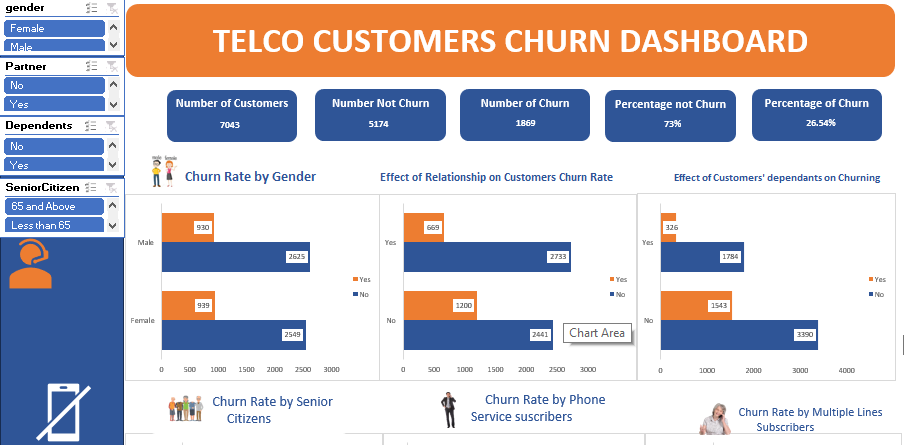

# Project Name: Telco Customers' Churn Analysis

...
## Project Objective

To carry out the analysis of a fiction company called Telco, analyzing the rate of and the reason for customers' churn, using Microsoft Excel.

## Problem Statement

1. What is the total number of customers?
2. What is the percentage of churn?
3. What is the rate of churn based on gender?
4. What is the churn rate based on relationship status?
5. Does customers' dependants have an effect on the rate of churn
6. What is the effect of tenure on churn rate?
7. What is the rate of churn across different services offered by Telco?
8. Which of the services has the highest churn rate and which has the lowest?
9. What is the top 10 tenure with the highest churn rate? 
10. Which tenure has the lowest churn rate?

....
## Data Sourcing

The dataset was sourced from www.kaggle.com, an online database engine.

## Data Transformation

- Data Gathering and Understanding: The key importance to success in any data project is to have a clear understanding of the data and the requirements of the project. After data gathering, I took time to understand the data model and the domain of the business.
 
- Data Cleaning: After understanding the data, I cleaned the data set by splitting complex data into columns, removing irrelevant columns, renaming columns, changing data types, and ensuring no duplicates, or null values, to present a suitable dataset for the solution to the project required, using Power Query on Excel.

- Data Transformation: After cleaning, I modeled and transformed the dataset into what can be suitable for analysis to precisely provide answers to the business questions and provide the needed results.

- - Data Analysis: With my new dataset, I was able to uncover insights by asking relevant questions and carrying out different analyses to provide the answers using Pivot Table in Excel.

- Data Visualization: By using the results of the analysis, Microsoft Excel was used to produce visualizations, and create a dashboard to describe the insights.

- Summary and Observations: Finally, these insights are used to highlight observations and unlock business decisions. 

               

## Visualization

The report comprises of 3 pages
1. The Cleaned data
2. The Analysis
3. The Insights

You can interact with the report [here]( https://docs.google.com/spreadsheets/d/1iYff-bxGKC7t4AppmQsEwFFWtLJwDpPF/edit?usp=sharing&ouid=108729194481815261047&rtpof=true&sd=true)

......
# Findings and Recommendations

## Findings

1. The total number of customers from all categories is 7,043.
2. Total number of customer churn is 1,869 representing 27% of the total customers, while the number of customers who did not churn is 5,174, representing 73% of the total customers.
3. Both churn and un-churn customers comprise both male and female, senior citizens and non-senior citizens, and they are spread across different services and payment methods.
4. Highest churn rate is recorded among customers in their first month, while the highest retention rate occurred among customers in their 72nd month.
5. Many of the customers do not have access to internet services.
6. Customers who pay manually have a higher rate of churn than customers who use automatic mode of payment.
7. Relationship has an effect on the rate of churn as we discovered that  there was a higher churn rate with customers with partners
8. There is a higher rate also with customers below 65 years of age. The rate of churn is not as much in the senior citizens' category as in the other customer category.

## Recommendations:

1. Efforts should be made to retain customers in the early days of the relationship as we discovered there is a high turnover of new customers. The same thing is also reflected in the mode of payment where we have a higher churn rate among customers who use manual mode of payment. This shows the customers have no motivation to continue renewing the relationship with Telco.
2. Telco should carry out further investigation into why new customers are not staying. Is there a new entrant in the market? Is this new entrant the cause of losing their customers? If that is the case, more inquiries should be made to understand what the competitor is offering that is lacking in their services and work on introducing a better alternative.
3. So also, Telco should also work to increase its market share by looking for a way to seduce the customers with "No internet" service and convert them. That is a new market opportunity to tap.
4. In summary, while this data set has helped to discover certain insights, more information is required to produce a more robust analysis. 

**_Disclaimer_** : _The datasets and reports do not represent any company, institution, or country, but just a dummy dataset sourced online to demonstrate the capabilities of Excel._

